# AxionERP — Documento técnico (Entregable, Parte 1)

**Asignatura:** Desarrollo de Software con Tecnologías Propietarias y Open Source I (ISO-615)
**Proyecto:** AxionERP · **Repositorio:** OpenSource1 · **Rama:** Fix-Features

> Por indicación académica, este documento no incluye portada. Las capturas provienen de una ejecución real del sistema
> sobre Docker Compose y las pruebas se ejecutaron sobre la misma versión del código.

## 1. Planteamiento del problema

### 1.1 Nombre del sistema

El sistema se denomina **AxionERP**. Se trata de una aplicación web de gestión empresarial (ERP) orientada a una pequeña o
mediana empresa comercial dominicana, que reúne en una sola plataforma la administración de clientes, productos,
existencias, facturación, cuentas por cobrar y la contabilidad asociada a esas operaciones, con acceso controlado según
el rol de cada usuario.

### 1.2 Situación actual

En la empresa de referencia, la información de clientes, productos, existencias, facturación y cuentas por cobrar se
registra en hojas de cálculo dispersas, mantenidas por distintas personas y sin una fuente única de verdad. No existe
control de acceso: cualquier empleado con el archivo puede consultar o alterar precios, saldos o existencias, y no queda
constancia de quién realizó cada cambio ni cuándo.

Esta situación produce errores frecuentes de existencia, porque las ventas no descuentan el inventario de forma
automática, y diferencias en los saldos de clientes, porque los cobros se anotan en un archivo distinto al de las
facturas. La conciliación se hace a mano al cierre de cada período, lo que consume tiempo y no ofrece trazabilidad sobre
los documentos emitidos.

### 1.3 Objetivo general

Centralizar la operación comercial de la empresa en un sistema web único, con persistencia en una base de datos
relacional y control de acceso por rol, de modo que cada usuario consulte y modifique únicamente la información que le
corresponde y que todo documento registrado quede trazable.

### 1.4 Objetivos específicos

- Implementar los mantenimientos de clientes, productos, categorías de producto y usuarios, con las acciones de agregar,
  modificar, eliminar, consultar y limpiar campos.
- Controlar el inventario mediante un libro de movimientos por almacén, del que se derivan las existencias y el costo.
- Registrar la facturación de ventas y las notas de crédito como borradores editables que, al postearse, generan sus
  asientos contables y de inventario.
- Llevar las cuentas por cobrar con cobros y aplicaciones sobre las facturas pendientes.
- Ofrecer búsquedas por varios criterios en cada listado y una búsqueda global de módulos y registros.
- Emitir reportes en PDF y exportaciones a Excel de los listados principales.
- Mantener una bitácora que permita auditar las operaciones realizadas en el sistema.

### 1.5 Usuarios del sistema

El sistema distingue tres roles, definidos con ASP.NET Core Identity. Cada rol se traduce en un conjunto de permisos que
la API evalúa en cada petición y que la interfaz utiliza para mostrar u ocultar las acciones disponibles. La
correspondencia es la misma que documenta la sección "Roles y permisos" del `README.md` del repositorio.

| Rol | Consultar | Agregar | Modificar | Eliminar | Configurar |
| - | - | - | - | - | - |
| `Administrador` | Sí | Sí | Sí | Sí | Sí |
| `Supervisor` | Sí | No | Sí | No | No |
| `Ejecutor` | Sí | Sí | No | No | No |

El Administrador gestiona además los usuarios y la configuración reservada del sistema, como las fechas de registro
permitidas. El Supervisor revisa y corrige la información existente sin crear ni eliminar registros, y el Ejecutor
registra nueva información y la consulta, pero no puede alterar lo ya registrado.

### 1.6 Alcance

El alcance de esta entrega comprende los módulos agrupados en el menú principal del sistema: Clientes, Productos,
Inventario, Ventas, Facturación, Contabilidad, Reportes, Configuración y Administración. Dentro de ellos se incluyen los
mantenimientos maestros, el libro de inventario, los borradores y documentos posteados de facturas y notas de crédito, el
libro de clientes con sus cobros, las consultas contables, los reportes PDF y Excel, la gestión de usuarios y la
bitácora.

### 1.7 Limitaciones

El sistema opera con una sola moneda, el peso dominicano (DOP), y no emite comprobantes fiscales electrónicos ante la
Dirección General de Impuestos Internos (DGII). No incluye el ciclo de compras ni la gestión de proveedores, por lo que
las entradas de inventario se registran mediante diarios de ajuste. El despliegue previsto es local, sobre contenedores
Docker orquestados con Docker Compose, y no contempla alta disponibilidad ni un entorno de nube.

### 1.8 Beneficios esperados

La empresa dispondrá de una sola fuente de datos para clientes, productos, existencias y saldos, lo que elimina la
conciliación manual entre archivos. Los permisos son coherentes entre la interfaz y la API: una acción que el rol no
permite no se muestra, y aunque se forzara la petición, la API la rechaza. Por último, los documentos posteados y los
libros de movimientos son de solo inserción (append-only), de modo que cada factura, nota de crédito o cobro queda
trazable y cualquier corrección se realiza con un documento nuevo en lugar de sobrescribir el anterior.

## 2. Tecnología y lenguaje

### 2.1 Plataforma elegida

AxionERP se desarrolló con **ASP.NET Core 10** y el lenguaje **C#**, sobre el marco `net10.0`, versión de soporte a
largo plazo (LTS) publicada en noviembre de 2025. La solución expone una API REST construida con controladores MVC y una
aplicación **Blazor Web App** en modo **Static SSR** (renderizado estático en el servidor) como capa de vistas. La base
de datos es **PostgreSQL 17**, a la que se accede con Entity Framework Core 10 (proveedor Npgsql) para las escrituras y
las migraciones, y con **Dapper** para las lecturas. La lógica de aplicación se organiza con **MediatR** y se valida con
FluentValidation; los reportes se generan con QuestPDF y las exportaciones con ClosedXML.

### 2.2 Justificación

La elección de ASP.NET Core 10 responde, en primer lugar, al soporte LTS, que garantiza actualizaciones de seguridad
durante la vida académica y operativa del proyecto. En segundo lugar, el servidor Kestrel ofrece un rendimiento elevado
con un consumo moderado de recursos, adecuado para un despliegue local en contenedores. En tercer lugar, el tipado
estático de C# se comparte entre capas: los DTOs definidos en `OpenSource1.Application` son los mismos que devuelve la
API y que consume la interfaz Blazor, lo que evita duplicar contratos y detecta en compilación cualquier incoherencia.

El ecosistema de .NET cubre, además, las dos formas de acceso a datos que el sistema necesita: EF Core para versionar el
esquema y persistir agregados con control de concurrencia, y Dapper para consultas SQL explícitas y eficientes. Por
último, la plataforma favorece la mantenibilidad y las pruebas: la solución cuenta con pruebas automatizadas en xUnit que
levantan la API y la interfaz en memoria con `WebApplicationFactory` y las ejecutan contra un PostgreSQL real en un
contenedor efímero creado por la propia fixture de pruebas.

### 2.3 Por qué Blazor Static SSR en lugar de MVC con Razor Views

Blazor en modo Static SSR produce el HTML en el servidor, igual que MVC con Razor Views, de modo que cada página llega al
navegador completamente renderizada y funciona sin JavaScript. La diferencia está en el modelo de composición: Blazor
permite construir la interfaz con componentes reutilizables, como la barra de acciones `PageToolbar`, la página de
formulario `EntityFormPage` y los componentes de campos `*Fields.razor` (por ejemplo, `ClienteFields.razor` o
`ProductoFields.razor`), que se comparten entre la creación y la edición de cada entidad.

Los formularios se envían por POST con token antiforgery y se enlazan al modelo mediante `[SupplyParameterFromForm]`,
mientras que los filtros y la paginación viajan en la cadena de consulta con `[SupplyParameterFromQuery]`. La navegación
mejorada de Blazor actualiza el contenido sin recargar la página completa. Como no se utiliza ningún modo interactivo, no
hay conexión WebSocket ni código WebAssembly en el navegador; esto mantiene el JWT fuera del alcance de JavaScript, ya que
el servidor Blazor lo guarda en una sesión de servidor asociada a una cookie HttpOnly.

## 3. Arquitectura del sistema

La figura 1 resume los componentes del sistema y el sentido de las dependencias entre ellos.

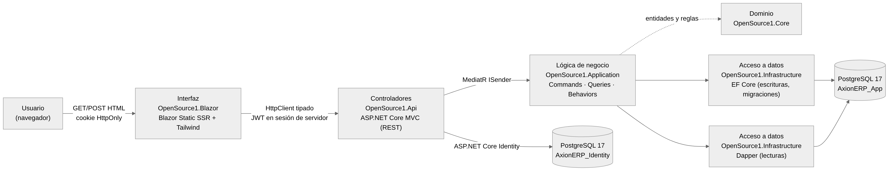

*Figura 1. Arquitectura de AxionERP: navegador, host Blazor Static SSR, API REST, capas de aplicación e infraestructura y PostgreSQL.*

### 3.1 Flujo de una petición

Una operación del usuario sigue siempre el mismo recorrido. El usuario interactúa con la interfaz Blazor, que envía un
formulario o una petición GET al servidor Blazor. Este, mediante un cliente HTTP tipado, llama al controlador
correspondiente de la API adjuntando el JWT guardado en la sesión de servidor. El controlador valida la autorización y
envía un comando o una consulta a la capa de aplicación a través de MediatR.

En la capa de aplicación, cada petición atraviesa una cadena de comportamientos (behaviors): `LoggingBehavior` registra
la operación, `ValidationBehavior` aplica las reglas de FluentValidation y `TransactionBehavior` envuelve los comandos en
una transacción. El manejador (handler) ejecuta la lógica de negocio y utiliza la capa de acceso a datos: EF Core para las
escrituras y Dapper para las lecturas, ambos sobre PostgreSQL. La respuesta regresa por el mismo camino y el servidor
Blazor la convierte en HTML.

### 3.2 Capas y proyectos

La solución sigue una arquitectura en capas de tipo Onion, en la que las dependencias apuntan hacia el dominio. Cada capa
es un proyecto independiente dentro de `test.slnx`:

| Proyecto | Responsabilidad |
| - | - |
| `OpenSource1.Core` | Entidades de dominio y abstracciones base. |
| `OpenSource1.Application` | Casos de uso, DTOs, CQRS, contratos y reglas de aplicación. |
| `OpenSource1.Infrastructure` | EF Core, Identity, Dapper, repositorios y Unit of Work. |
| `OpenSource1.Api` | Endpoints HTTP, autenticación JWT y autorización por políticas. |
| `OpenSource1.Blazor` | Interfaz web Blazor, formularios, menú y consumo de API. |

El dominio no depende de ninguna otra capa; la aplicación depende solo del dominio y define las interfaces que la
infraestructura implementa. La API y la interfaz Blazor son los puntos de entrada: la primera compone todas las capas del
servidor y la segunda únicamente se comunica con la API por HTTP, sin acceso directo a la base de datos.

### 3.3 Seguridad en la arquitectura

La autenticación se basa en un JWT emitido por la API tras validar las credenciales con ASP.NET Core Identity. El
servidor Blazor recibe ese token y lo guarda en una sesión de servidor; al navegador solo llega una cookie de sesión
marcada como HttpOnly y `SameSite=Strict`, que JavaScript no puede leer. De esta forma el token no se almacena en
`localStorage`, `sessionStorage` ni en cookies accesibles desde el cliente.

La autorización utiliza las políticas `CanConsult`, `CanAdd`, `CanModify`, `CanDelete` y `CanAdministrar`, derivadas del
rol del usuario y evaluadas en ambos lados. La interfaz las usa para ocultar menús y acciones que el usuario no puede
ejecutar, pero la decisión final corresponde a la API: si una petición llega sin el permiso necesario, la API responde
con un código 403 real, que la interfaz muestra al usuario como mensaje de error.

## 4. Diseño de la base de datos

El modelo entidad-relación completo reúne 42 tablas, por lo que se presenta dividido en dos vistas parciales generadas
automáticamente a partir del esquema real de la base de datos: la figura 2 recoge los maestros (clientes, productos,
categorías, unidades, términos de pago, usuarios y roles) junto con los libros de inventario, y la figura 3 recoge los
documentos de venta, las notas de crédito y las cuentas por cobrar. El diagrama completo (`diagramas/modelo-er.png`) y su
fuente Mermaid se conservan en la carpeta `diagramas/` para su consulta.

*Figura 2. Modelo entidad-relación parcial: maestros, identidad e inventario.*

*Figura 3. Modelo entidad-relación parcial: facturación, notas de crédito y cuentas por cobrar.*

### 4.1 Bases de datos

El sistema utiliza dos bases de datos PostgreSQL independientes dentro del mismo servidor. La base `AxionERP_App`
contiene el modelo de negocio: maestros, libros de movimientos, documentos de venta y contabilidad. La base
`AxionERP_Identity` contiene las tablas de ASP.NET Core Identity con los usuarios, los roles y sus asignaciones. La
separación aísla las credenciales del resto de los datos y permite versionar cada esquema con su propio contexto de EF
Core.

### 4.2 Correspondencia con las entidades solicitadas

El enunciado solicita un conjunto de entidades de referencia. La siguiente tabla indica en qué tablas reales del sistema
se materializa cada una; los nombres corresponden al esquema generado por las migraciones.

| Entidad solicitada | Tabla(s) reales | Observaciones |
| - | - | - |
| Usuarios / Roles | `AspNetUsers`, `AspNetRoles`, `AspNetUserRoles` (base `AxionERP_Identity`) | ASP.NET Core Identity; permisos coarse derivados del rol. |
| Clientes | `SociosNegocio` | Código correlativo, tipo, documento fiscal (RNC/cédula), término de pago, límite de crédito, grupos contables. |
| Productos | `Productos` | Precio, unidad base, método de costeo, costo unitario vigente, grupos contables. |
| Categorías | `CategoriasProducto` | Jerarquía con categoría padre. |
| Inventario | `MovimientosProducto`, `MovimientosValor`, `Almacenes` | Libro append-only de cantidades y de costo por almacén. |
| Ventas / DetalleVenta / Facturas | `FacturasVenta`, `LineasFacturaVenta`, `LineasIvaFacturaVenta` (+ `FacturasVentaBorrador`, `LineasFacturaVentaBorrador`) | Borrador editable y documento posteado inmutable. |
| CuentasPorCobrar | `MovimientosCliente`, `MovimientosClienteDetalle` | Importe restante derivado; cobros y aplicaciones. |

Además de estas tablas, el esquema incluye las de soporte que requieren los procesos descritos: unidades de medida,
términos de pago, series de numeración, plan de cuentas, grupos y configuraciones contables, diarios de inventario,
notas de crédito y el libro contable (`MovimientosContables`).

### 4.3 Claves y tipos principales

El detalle completo de claves primarias, claves foráneas y tipos de cada columna se recoge en el diccionario de datos
`diagramas/diccionario-datos.md`. En términos generales, las tablas maestras (socios de negocio, productos, categorías,
almacenes) usan claves primarias de tipo `uuid`; los documentos posteados, como `FacturasVenta`, usan como clave primaria
su `Numero` de tipo texto, asignado por la serie de numeración; y los libros de movimientos usan claves `bigint` de
identidad generadas por la base de datos.

Los importes monetarios, precios y costos se almacenan como `numeric(18,4)`, las cantidades como `numeric(18,6)` y los
porcentajes de descuento e impuesto como `numeric(9,5)`, lo que evita los errores de redondeo propios de los tipos de
coma flotante. Las tablas editables incorporan la columna de sistema `xmin` de PostgreSQL como token de concurrencia.

## 5. Persistencia de datos

### 5.1 Code First con migraciones de EF Core

El esquema se define con el enfoque Code First: las entidades y sus configuraciones en C# son la fuente del modelo, y EF
Core genera a partir de ellas las migraciones que crean y modifican las tablas. El contexto de aplicación acumula **38**
migraciones en `src/OpenSource1.Infrastructure/Data/Migrations/Application`, y el contexto de identidad dispone de las
suyas en `src/OpenSource1.Infrastructure/Identity/Migrations`. La API aplica las migraciones pendientes al arrancar
cuando la opción `Database__ApplyMigrationsOnStartup` está activa.

Este enfoque mantiene el esquema versionado junto al código en el mismo repositorio, de modo que cada cambio de modelo
queda revisado y registrado en el historial de Git. También hace que la base de datos sea reproducible: el mismo conjunto
de migraciones construye el esquema en el entorno de Docker Compose y en los contenedores efímeros de las pruebas
automatizadas, sin scripts manuales.

### 5.2 Lecturas con Dapper

Los listados paginados y las consultas con filtros se resuelven con Dapper, que ejecuta SQL explícito y proyecta el
resultado directamente sobre DTOs de lectura. Los filtros de texto se aplican con `ILIKE … ESCAPE`, escapando los
metacaracteres del patrón para que la búsqueda sea literal, y los valores siempre viajan como parámetros, nunca
concatenados en la sentencia. La columna de ordenamiento que elige el usuario se valida contra una lista blanca de
columnas permitidas antes de incorporarse a la cláusula `ORDER BY`, lo que impide la inyección de SQL por esa vía.

### 5.3 Transacciones y concurrencia

Cada comando se ejecuta dentro de una transacción gestionada por `TransactionBehavior`: si el manejador termina
correctamente, los cambios se confirman; si ocurre un error, se revierten en bloque. Esto es esencial en operaciones como
el posteo de una factura, que inserta el documento, sus líneas, los movimientos de inventario, el movimiento del cliente
y los asientos contables en una sola unidad.

La concurrencia se controla de forma optimista con la columna `xmin`. Al editar un registro, la interfaz conserva la
versión leída y la envía con la modificación; si otro usuario cambió el registro en el intervalo, la versión ya no
coincide, EF Core detecta el conflicto y la API responde con un código 409 que informa al usuario de que debe recargar los datos en lugar de
sobrescribir cambios ajenos.

## 6. Mantenimientos (CRUD)

### 6.1 Patrón común de los mantenimientos

Los cuatro mantenimientos maestros que exige el enunciado (Clientes, Productos, Categorías de producto y Usuarios) siguen
un mismo patrón de interacción, lo que reduce el aprendizaje del usuario y el código duplicado. Cada mantenimiento se
compone de una página de listado, que actúa como pantalla de consulta, y de una página-tarjeta de formulario compartida
entre la creación y la edición:

| Acción | Cómo se realiza | Ejemplo (Clientes) |
| - | - | - |
| Agregar | Botón `+ Nuevo` de la barra de acciones, que abre la página-tarjeta vacía. | `/clientes/nuevo` |
| Consultar | Listado paginado con filtros, orden por columna y selección de una fila. | `/clientes?sel={id}` |
| Modificar | Botón `Editar` de la barra, habilitado cuando hay una fila seleccionada. | `/clientes/{id}/editar` |
| Eliminar | Botón `Eliminar` de la barra (en usuarios, desde la ficha), con diálogo de confirmación antes del POST. | `/clientes?sel={id}` + confirmación |
| Limpiar campos | Botón `Limpiar campos` del formulario, que vuelve a cargar la tarjeta sin datos. | `/clientes/nuevo` |

La barra de acciones es el componente `PageToolbar`, común a listados y fichas: muestra el título, las migas de pan y las
acciones `+ Nuevo`, `Crear ▾`, `Ver ▾`, `Editar` y `Eliminar`. Una acción para la que el usuario no tiene permiso no se
genera en el HTML, y una acción que requiere una fila seleccionada aparece deshabilitada, con un texto explicativo, hasta
que el usuario selecciona un registro. La selección viaja en la cadena de consulta (`?sel=`), de modo que es compatible
con el renderizado estático: no requiere estado en el navegador y la URL resultante puede recargarse o compartirse. Si
el identificador seleccionado ya no figura en la página actual (por ejemplo, porque otro usuario lo eliminó), la barra
trata la selección como vacía y nunca enlaza a un registro que la lista no muestra.

El formulario se construye con el componente `EntityFormPage`, que aporta el encabezado de la tarjeta, el resumen de
errores y los botones `Guardar`, `Limpiar campos` y `Cancelar`. Los campos de cada entidad residen en un componente
propio (`ClienteFields.razor`, `ProductoFields.razor`, etc.), reutilizado en la creación y en la edición. El botón
`Limpiar campos` es un enlace que vuelve a solicitar el formulario vacío: al tratarse de Static SSR, esta solución no
depende de JavaScript y garantiza que el formulario regrese exactamente a su estado inicial, incluidos los valores por
defecto que asigna el servidor. `Cancelar` regresa al listado conservando sus filtros; la dirección de retorno se valida
como ruta local, de forma que un parámetro `returnUrl` manipulado (`//sitio-externo`, `javascript:`) nunca provoca una
redirección fuera de la aplicación.

La justificación de este diseño es doble. Por un lado, separar el listado de la tarjeta de formulario evita que la
consulta y la edición compitan por el mismo espacio y permite que cada operación tenga una URL propia. Por otro, al
concentrar el comportamiento en `PageToolbar` y `EntityFormPage`, cualquier mejora (por ejemplo, la validación de la
dirección de retorno o el texto de las acciones deshabilitadas) se aplica de una vez a todos los mantenimientos.

### 6.2 Permisos por acción

Las acciones de los mantenimientos se asocian a las políticas descritas en la sección 1.5. La tabla siguiente resume qué
roles pueden ejecutar cada acción; la interfaz aplica la misma regla que la API, de modo que el usuario solo ve lo que
puede ejecutar.

| Acción | Política | Administrador | Supervisor | Ejecutor |
| - | - | - | - | - |
| Consultar listados y fichas | `CanConsult` | Sí | Sí | Sí |
| Agregar (`+ Nuevo`, `Crear ▾`) | `CanAdd` | Sí | No | Sí |
| Modificar (`Editar`) | `CanModify` | Sí | Sí | No |
| Eliminar | `CanDelete` | Sí | No | No |
| Gestión de usuarios | `CanAdministrar` | Sí | No | No |

Si un usuario forzara el envío de un formulario oculto, la petición llegaría a la API, que respondería con un código 403;
la interfaz muestra entonces el mensaje real devuelto por la API. Esta doble comprobación evita que la seguridad dependa
de lo que el navegador muestre.

### 6.3 Clientes

El mantenimiento de clientes opera sobre la tabla `SociosNegocio`. El alta se realiza en `/clientes/nuevo` con los
datos generales (nombre comercial, razón social, documento fiscal, contacto y dirección) y los datos comerciales
(término de pago, límite de crédito y grupos contables); el código se asigna de forma correlativa. La figura 4 muestra el
formulario de alta completado.

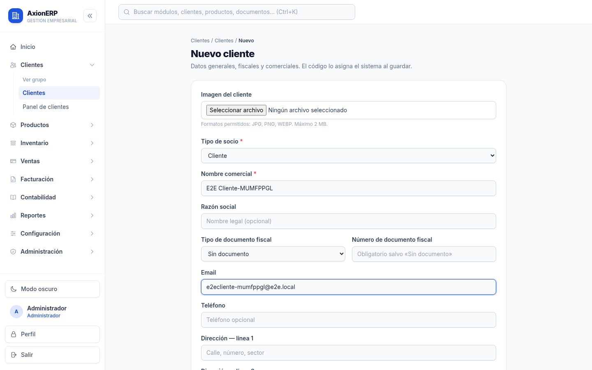

*Figura 4. Formulario de nuevo cliente (`/clientes/nuevo`) con los datos del registro.*

Las reglas de validación se definen con FluentValidation en la capa de aplicación y se reflejan en el formulario. Si el
usuario intenta guardar sin un dato obligatorio, el formulario se vuelve a mostrar con los valores introducidos y el
mensaje correspondiente junto al campo, como se aprecia en la figura 5.

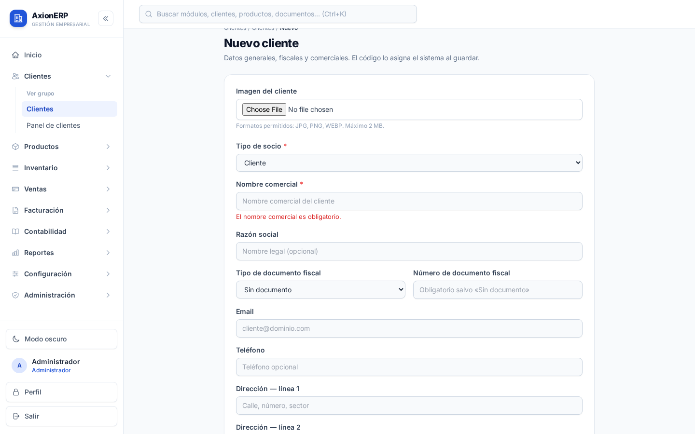

*Figura 5. Validación del alta: el nombre comercial es obligatorio.*

La consulta se hace en el listado `/clientes`, que admite filtros por varios campos, orden y paginación. Al seleccionar
una fila, la barra habilita las acciones que dependen del registro (figura 6). Tras modificar el cliente en
`/clientes/{id}/editar`, el sistema vuelve al listado con un aviso de confirmación y la fila actualizada (figura 7).

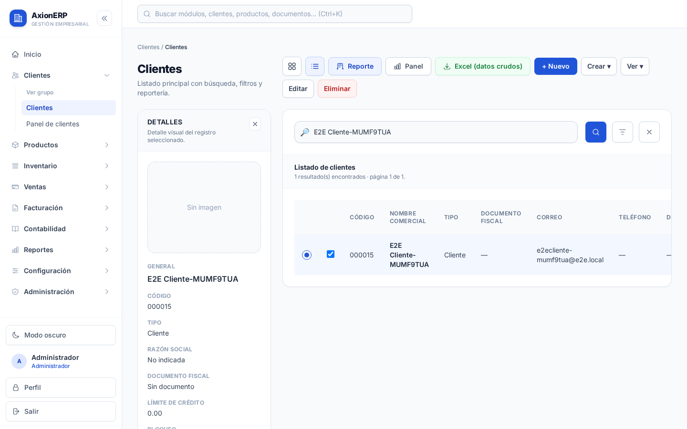

*Figura 6. Listado de clientes con una fila seleccionada y las acciones Editar y Eliminar habilitadas.*

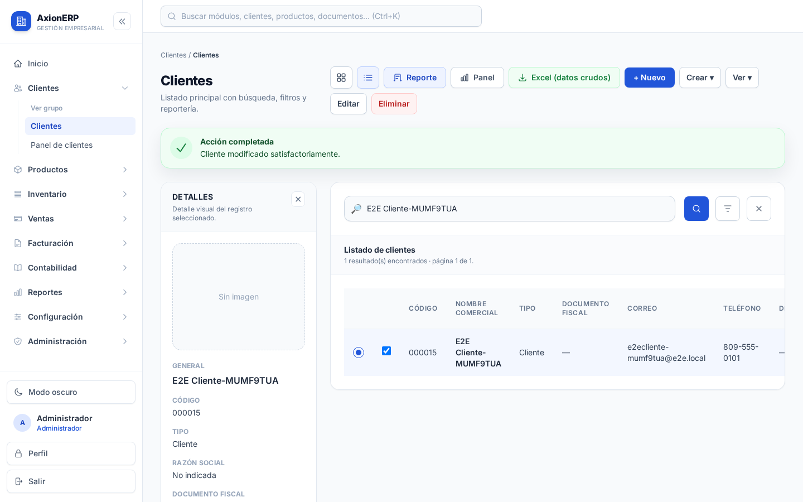

*Figura 7. Aviso «Cliente modificado» y fila con el teléfono actualizado.*

La eliminación exige confirmación explícita mediante un diálogo (figura 8). Para no romper la trazabilidad de los
documentos que referencian al cliente, el borrado es lógico: el registro se marca con `IsDeleted` y deja de aparecer en
los listados, pero se conserva en la base de datos.

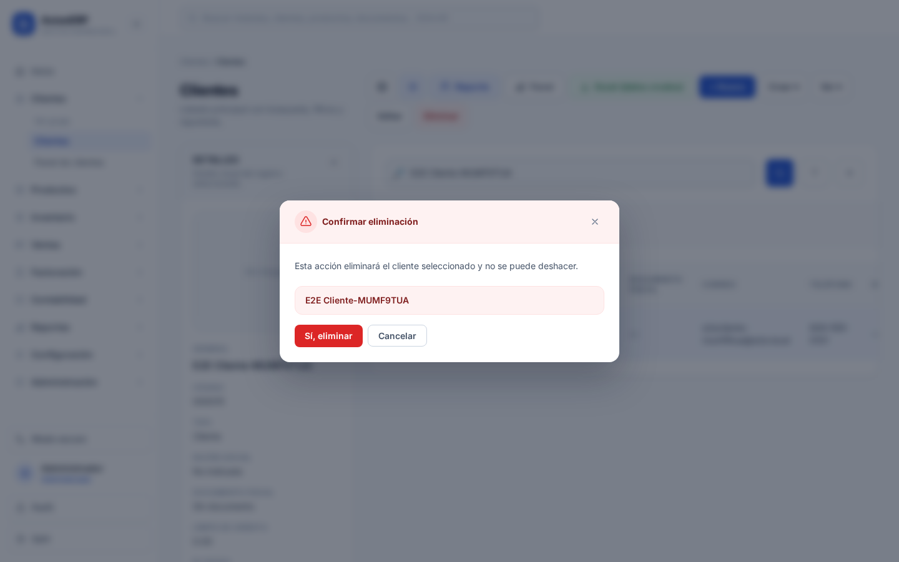

*Figura 8. Diálogo de confirmación antes de eliminar un cliente.*

Una vez confirmada la eliminación, el listado vuelve a mostrarse con el aviso correspondiente y el cliente ya no figura
en él: la figura 9 repite la búsqueda por su nombre y no obtiene resultados.

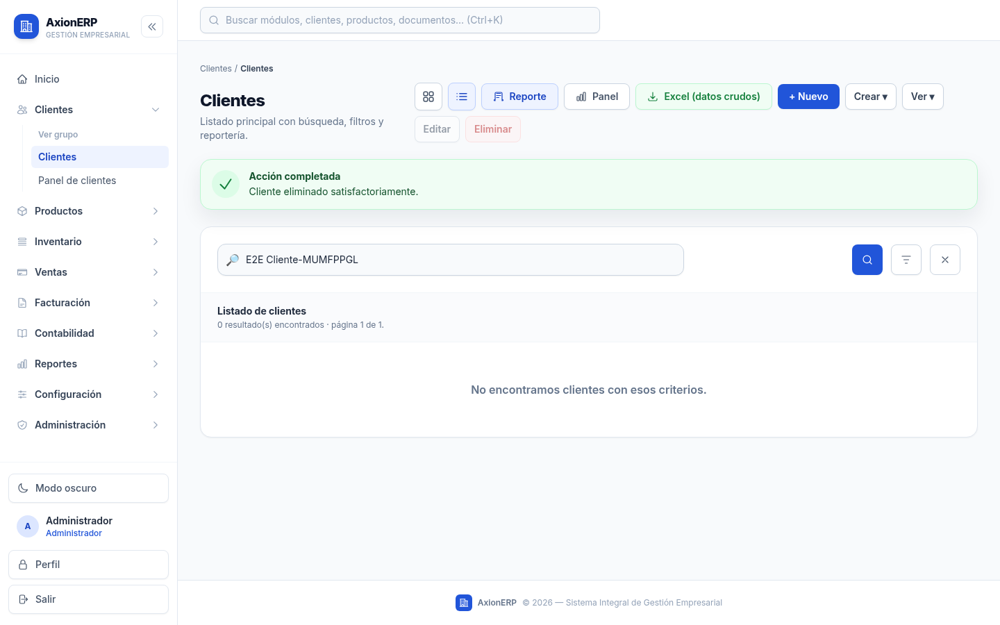

*Figura 9. Aviso «Cliente eliminado» y búsqueda del cliente sin resultados.*

### 6.4 Productos

El mantenimiento de productos (`/productos/nuevo` y `/productos/{id}/editar`) registra el código, el nombre, la
categoría, la unidad de medida base, el precio de venta, el método de costeo y los grupos contables. La existencia y el
costo unitario no se editan en el formulario: se derivan del libro de movimientos de inventario, lo que garantiza que
coincidan siempre con los documentos registrados. La figura 10 muestra el alta de un producto; la figura
11 muestra el listado tras modificarlo, y la figura 12 la confirmación previa a su
eliminación, que, como en los clientes, es lógica. El listado de productos es, además, el ejemplo principal de búsqueda
por varios criterios, que se describe en la sección 7.

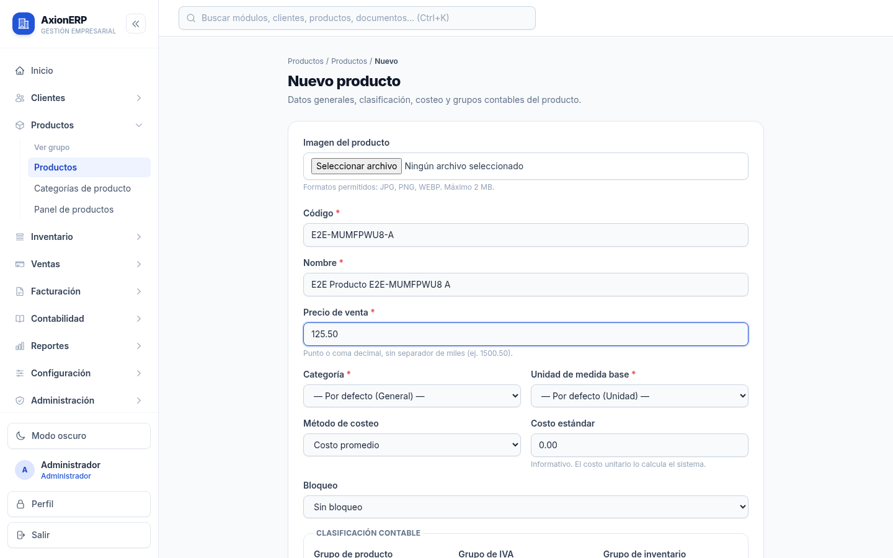

*Figura 10. Formulario de nuevo producto (`/productos/nuevo`).*

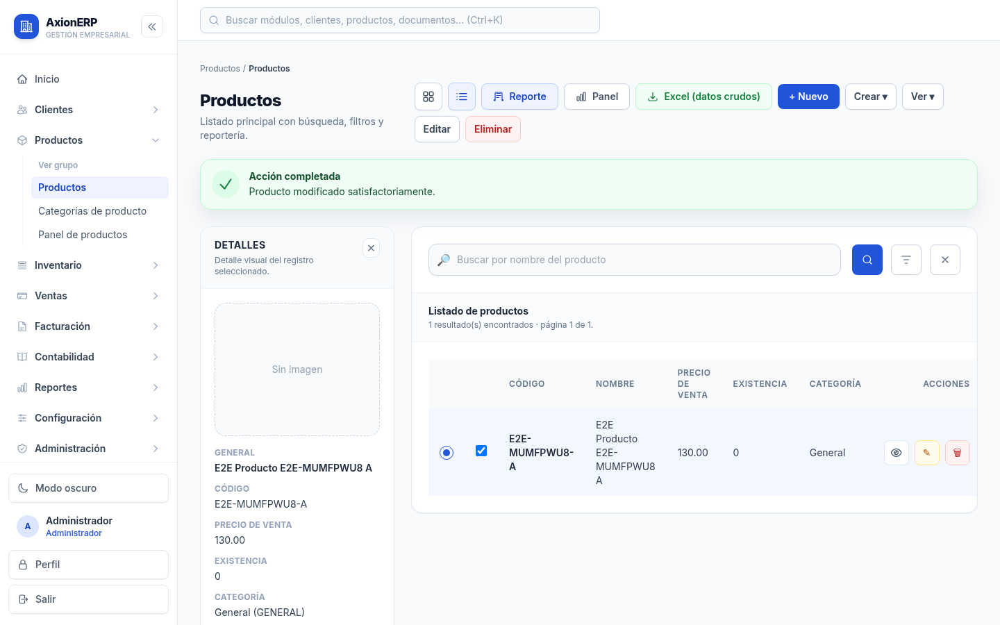

*Figura 11. Aviso «Producto modificado» con el nuevo precio de venta (130.00) y el panel de detalle.*

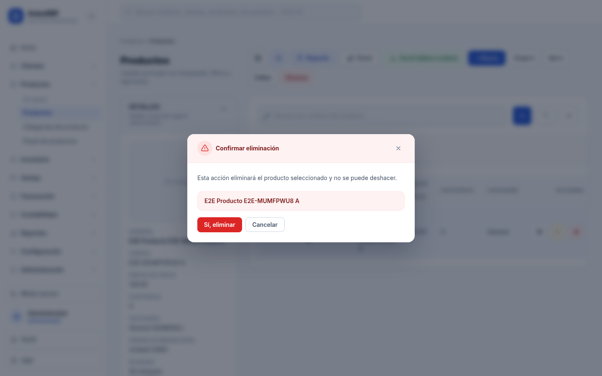

*Figura 12. Confirmación antes de eliminar un producto.*

### 6.5 Categorías de producto

Las categorías (`/categorias-producto`) forman una jerarquía mediante la categoría padre y se gestionan con el mismo
patrón de listado y tarjeta. La figura 13 muestra el listado, que sirve de pantalla de consulta; la
figura 14, el formulario de alta; la figura 15, el resultado de una modificación, y
la figura 16, la confirmación de la eliminación.

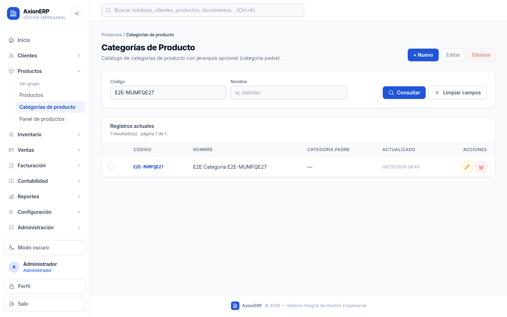

*Figura 13. Listado de categorías de producto filtrado por el código de la categoría de prueba.*

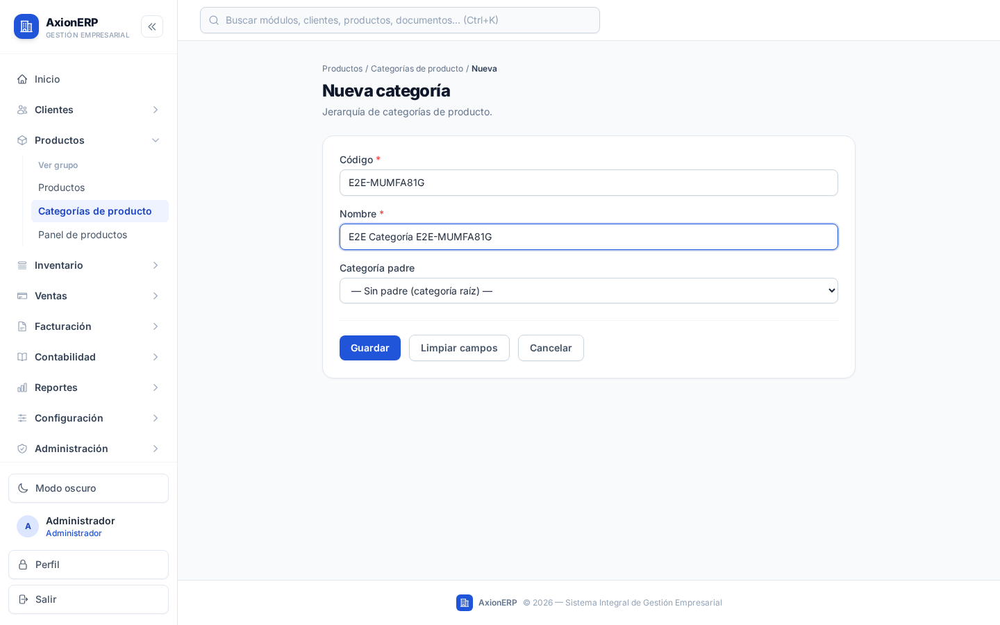

*Figura 14. Formulario de nueva categoría de producto.*

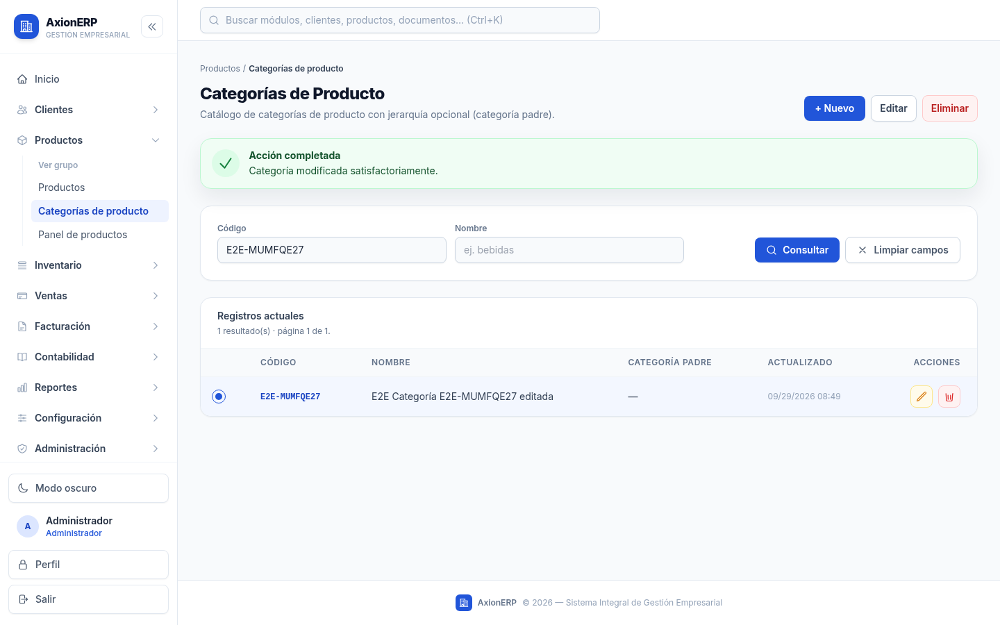

*Figura 15. Aviso «Categoría modificada» con el nombre editado.*

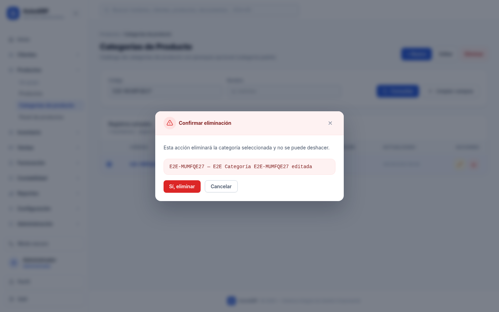

*Figura 16. Confirmación antes de eliminar una categoría de producto.*

### 6.6 Usuarios

La gestión de usuarios está reservada al Administrador (`CanAdministrar`). El alta se hace en una página propia,
`/admin/users/nuevo`, en la que se indican el nombre, el correo, el nombre de usuario, la contraseña inicial y el rol
(figura 17). Al guardar, el sistema vuelve al listado de usuarios con el aviso correspondiente (figura
18).

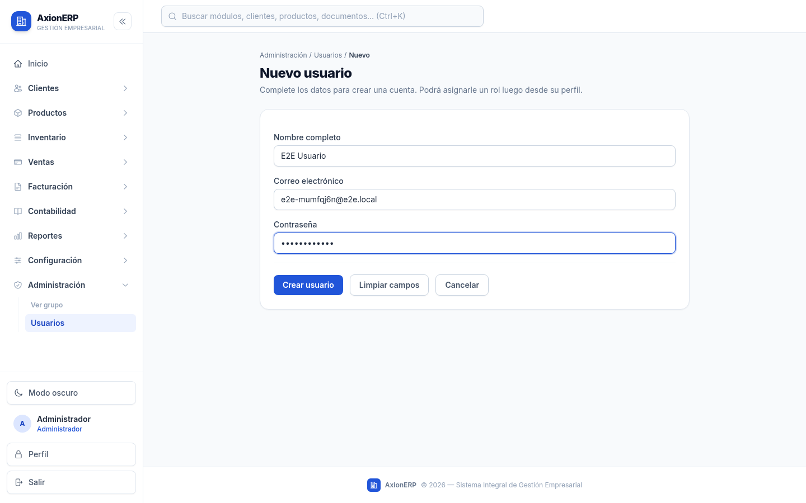

*Figura 17. Alta de usuario en su página propia (`/admin/users/nuevo`).*

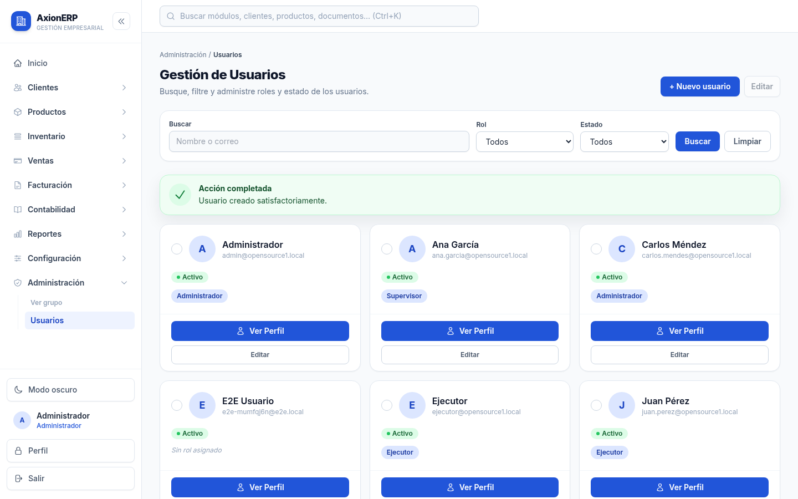

*Figura 18. Gestión de usuarios con el aviso de usuario creado.*

A diferencia de los demás mantenimientos, la lista de usuarios no ofrece la acción Eliminar en la barra: por diseño,
las operaciones sobre una cuenta se hacen desde su ficha (`/admin/users/{id}`, figura 19), que reúne sus
datos y permite modificar el rol y el estado de la cuenta. La desactivación (figura 20) es la forma
recomendada de retirar el acceso, porque impide iniciar sesión y conserva el historial de la bitácora asociado al
usuario. La eliminación definitiva también se hace desde la ficha y, como el resto de eliminaciones, requiere
confirmación (figura 21).

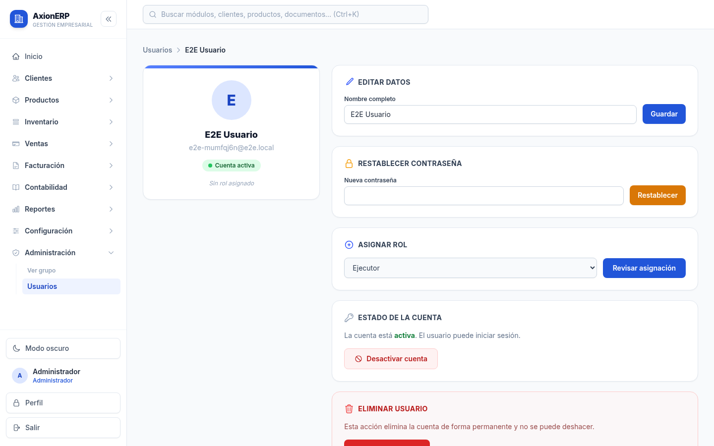

*Figura 19. Ficha de un usuario (`/admin/users/{id}`).*

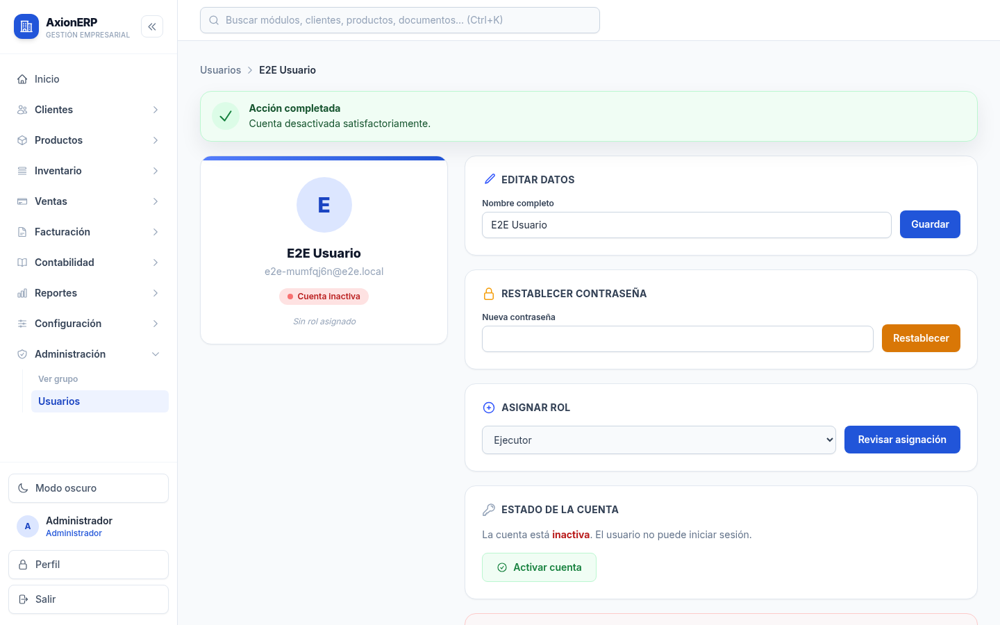

*Figura 20. Aviso «Cuenta desactivada»: estado inactivo, asignación de rol y opción de reactivarla.*

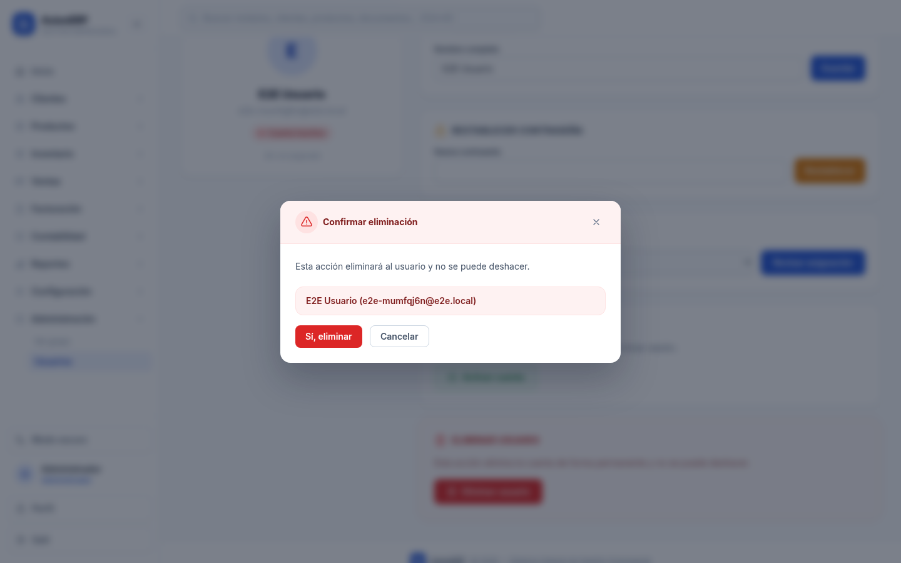

*Figura 21. Confirmación de la eliminación definitiva de un usuario desde su ficha.*

## 7. Búsquedas y consultas

### 7.1 Búsqueda por varios criterios en los listados

Cada listado dispone de un panel de filtros que se envía por GET, de modo que los criterios quedan en la URL y la
consulta puede repetirse, compartirse o paginarse sin perder el contexto. El listado de productos admite filtrar por
código, nombre, categoría, precio de venta y estado de existencia; las figuras 22 a 26 muestran cada uno de estos
criterios aplicados. Para que la evidencia demuestre también la exclusión, la prueba automatizada crea dos productos
(A, de 125.50 en la categoría GENERAL, y B, de 99.00 en otra categoría) y comprueba en cada búsqueda que aparece A y no
aparece B; la única excepción es el estado de existencia, explicada en el pie de la figura 26.

Los filtros de texto aceptan una sintaxis sencilla y documentada: el asterisco `*` actúa como comodín (`CAB*` busca los
códigos que empiezan por «CAB»), `||` combina alternativas (`tornillo||tuerca`) y `&&` exige que se cumplan varias
condiciones a la vez. En el servidor, la clase `FilterExpressionBuilder` convierte cada término en una condición
`ILIKE … ESCAPE` parametrizada: antes de traducir el asterisco, escapa los metacaracteres propios de `LIKE` (`%`, `_` y
`\`), de modo que un término como `50%` se busca literalmente. Los filtros numéricos, como el precio, validan el valor
antes de consultar y devuelven un mensaje claro si no es un número. El estado de existencia distingue los productos con
existencia de los que no la tienen.

*Figura 22. Productos filtrados por código.*

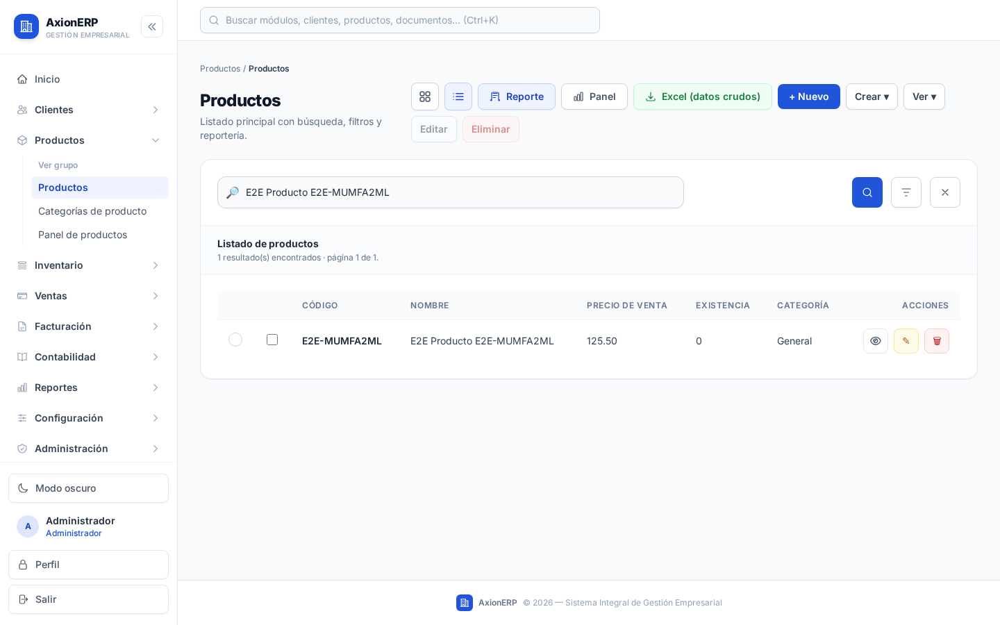

*Figura 23. Productos filtrados por nombre.*

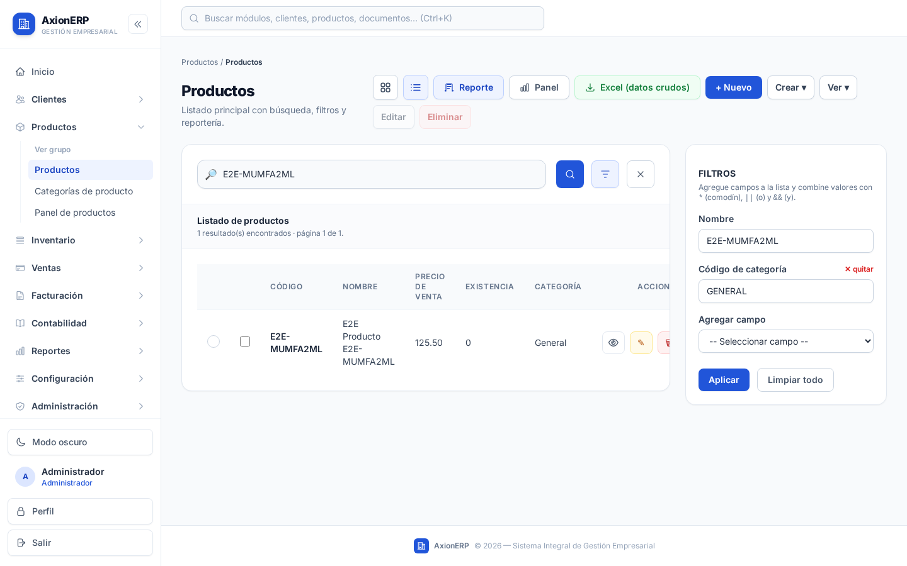

*Figura 24. Productos filtrados por categoría.*

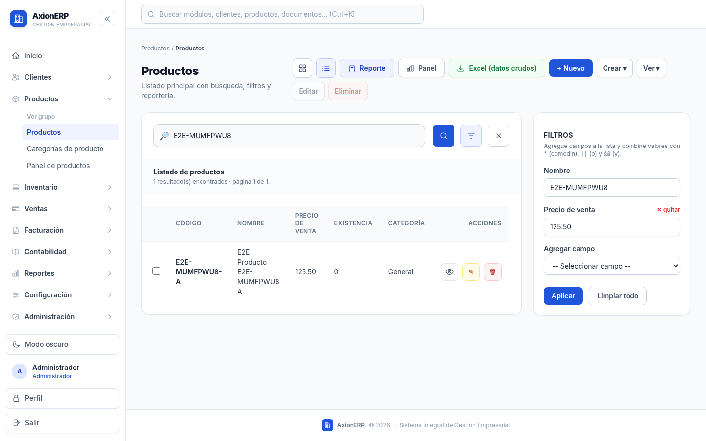

*Figura 25. Productos filtrados por precio de venta.*

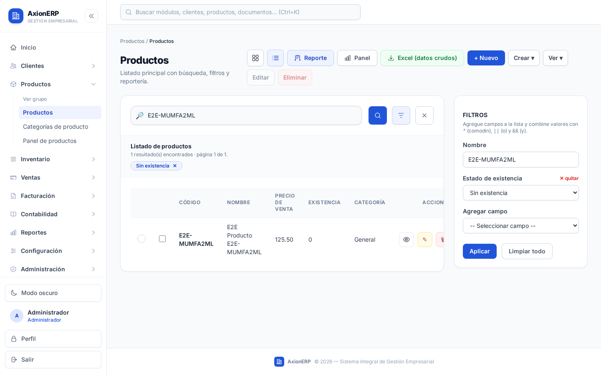

*Figura 26. Productos filtrados por estado «Sin existencia». Los dos productos de prueba aparecen porque ninguno tiene existencia: darles existencia exigiría postear un diario de inventario, que es irreversible.*

### 7.2 Búsqueda global y paleta Ctrl+K

Además de los filtros de cada listado, el sistema ofrece una búsqueda global accesible desde la barra superior. Sin
JavaScript, la caja de búsqueda es un formulario GET que abre `/buscar?q=…`, una página renderizada en el servidor que
muestra los módulos coincidentes y los registros encontrados (figura 28). Con JavaScript disponible, la misma caja se
convierte en una paleta de comandos que se abre con Ctrl+K (o con la tecla `/`), sugiere módulos mientras se escribe y
permite navegar con las flechas, Enter y Esc (figura 27). Esta estrategia de mejora progresiva garantiza que la función
existe siempre y que el script solo la hace más cómoda.

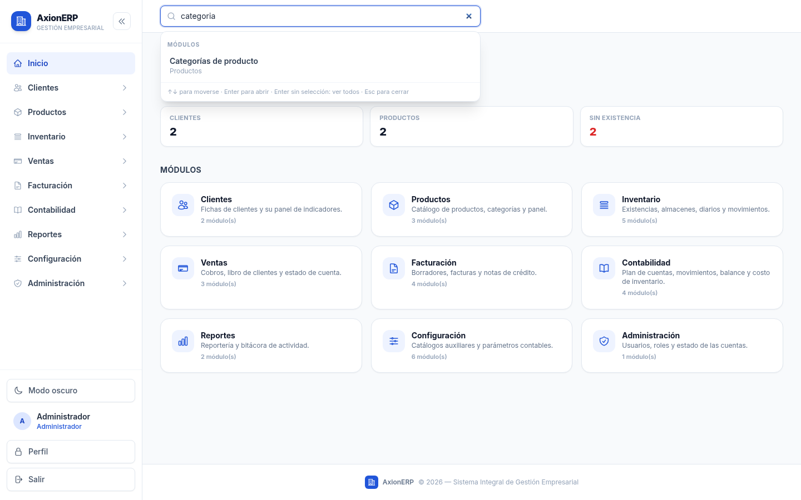

*Figura 27. Paleta Ctrl+K sugiriendo el módulo Categorías de producto.*

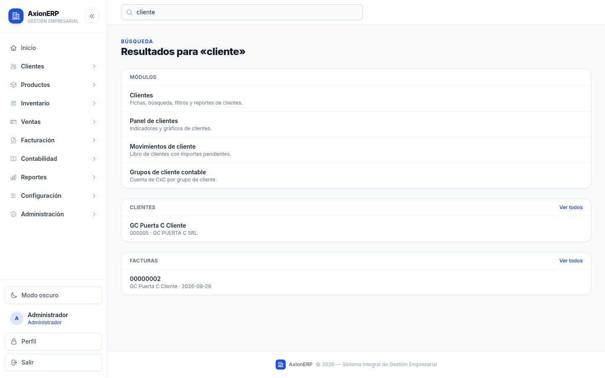

*Figura 28. Página `/buscar?q=cliente` con módulos, clientes y facturas.*

Los módulos se filtran sin distinguir mayúsculas ni acentos (por ejemplo, «categoria» encuentra «Categorías de
producto») y solo se ofrecen los que el usuario puede abrir. Los registros (clientes, productos, facturas, borradores de
factura, notas de crédito y sus borradores) se obtienen del endpoint `GET /api/busqueda` de la API, que exige un término
de 2 a 100 caracteres una vez recortado, devuelve un número limitado de resultados por tipo y consulta con `ILIKE`
escapado. La paleta no llama directamente a la API: solicita `/buscar/sugerencias` al servidor Blazor, que realiza la
llamada con la sesión del usuario, con lo que el JWT nunca llega al navegador. Si la API no responde, la paleta y la
página `/buscar` siguen mostrando los módulos junto con un aviso para los registros, en lugar de fallar por completo.

## 8. Menú y navegación

### 8.1 Acceso e inicio

El acceso se realiza desde la pantalla de inicio de sesión (figura 29). Tras autenticarse, el usuario llega a la página
de inicio, que presenta indicadores y una tarjeta por cada grupo de módulos al que tiene acceso (figura 30).

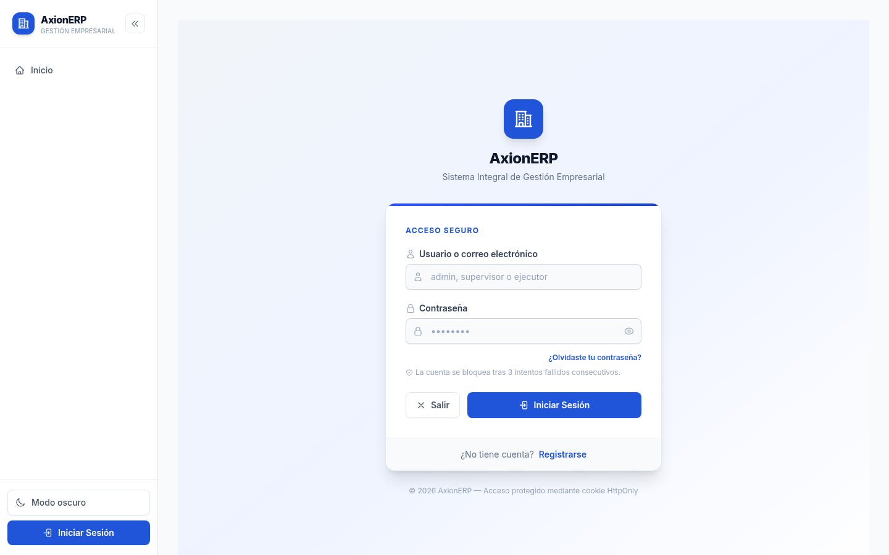

*Figura 29. Pantalla de inicio de sesión.*

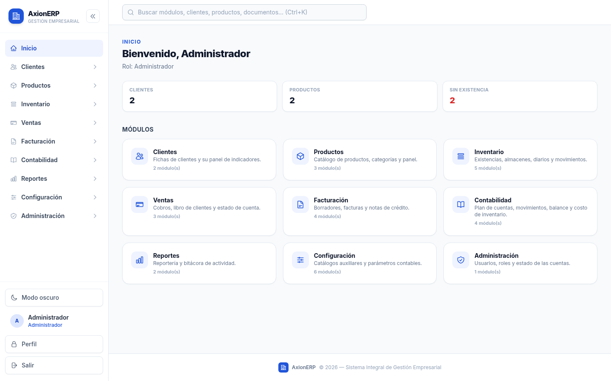

*Figura 30. Inicio del administrador con indicadores y tarjetas de los grupos de módulos.*

### 8.2 Menú por grupos

Los módulos se organizan en grupos definidos en un registro único, `CatalogoModulos`: junto al enlace de Inicio, los
grupos son Clientes, Productos, Inventario, Ventas, Facturación, Contabilidad, Reportes, Configuración y Administración.
El menú lateral, la página de inicio, las páginas de grupo, la búsqueda global y la paleta Ctrl+K leen de ese mismo
registro, y una prueba automatizada comprueba que cada listado con ruta propia está registrado y que cada ruta
registrada existe. Así se evita que el menú y las páginas diverjan con el tiempo.

El menú lateral muestra abierto el grupo al que pertenece la página actual (figura 31), y cada grupo tiene una página
propia en `/modulos/{grupo}` con sus indicadores y sus módulos (figura 32). La visibilidad depende del rol: el Ejecutor,
por ejemplo, no ve el grupo Administración (figura 33, que muestra además el modo oscuro, cuya preferencia se conserva
entre sesiones).

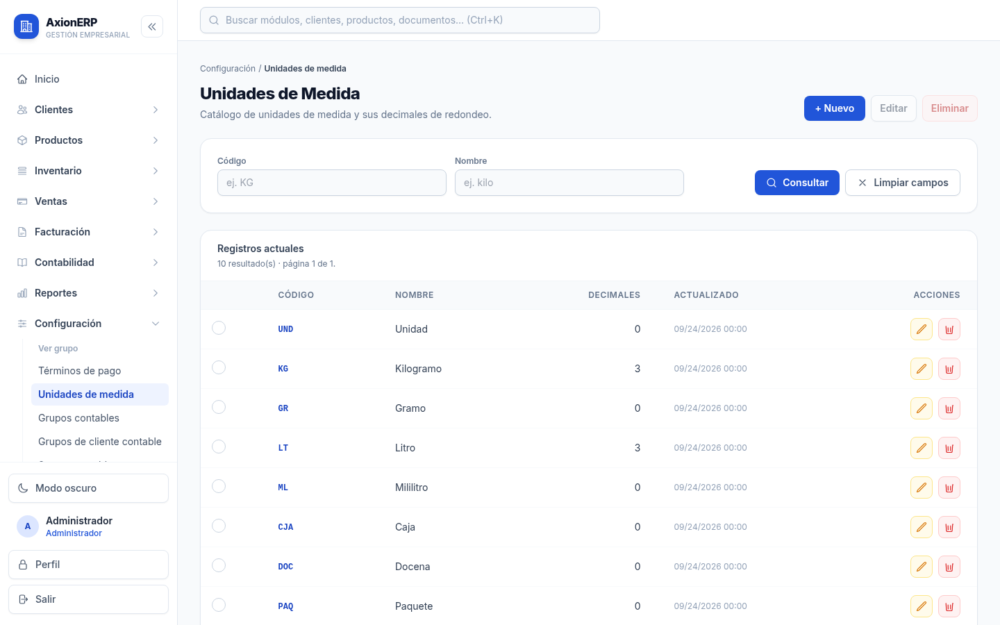

*Figura 31. Menú lateral por grupos, con Configuración abierto en Unidades de medida.*

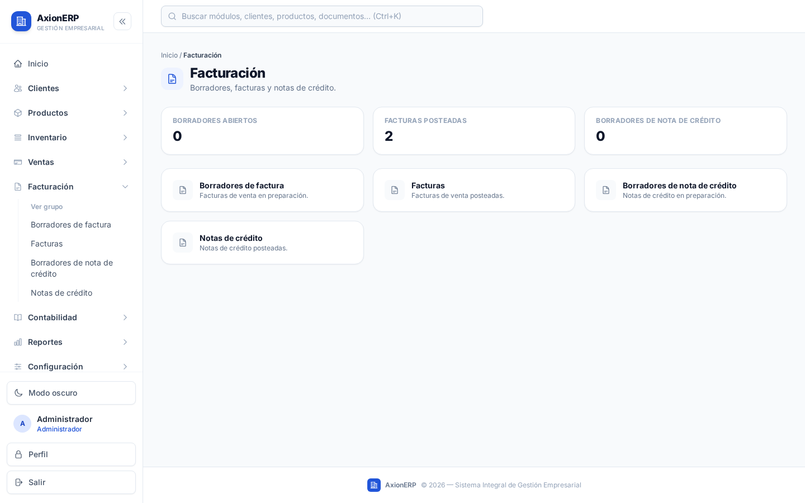

*Figura 32. Página del grupo Facturación (`/modulos/facturacion`) con indicadores y módulos.*

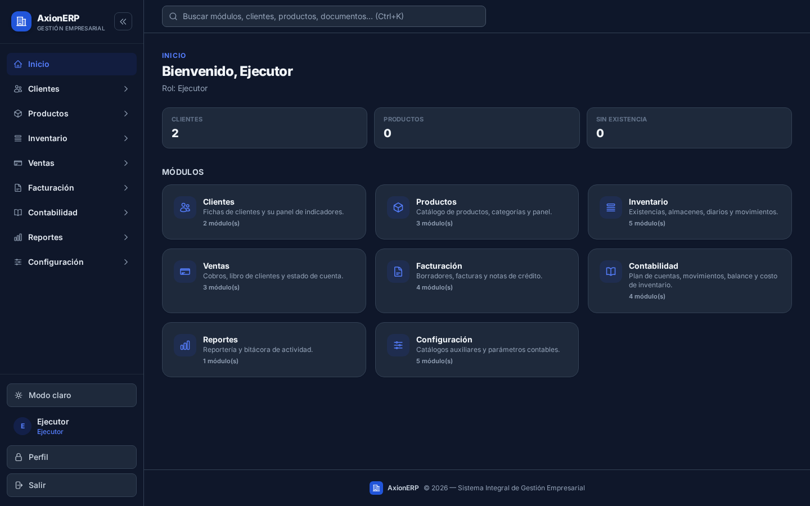

*Figura 33. Inicio del Ejecutor en modo oscuro, sin el grupo Administración.*

### 8.3 Acciones contextuales

La barra `PageToolbar` agrupa las acciones relacionadas con el registro seleccionado en dos menús desplegables nativos
(`
`), que funcionan sin JavaScript. `Crear ▾` inicia documentos a partir del registro: desde un cliente se puede
crear una factura, una nota de crédito o un cobro (figura 34), y la nueva factura se abre con el cliente, su término de
pago y la fecha de hoy ya cargados (figura 35). `Ver ▾` lleva a la información relacionada: desde un producto, su ficha,
sus existencias y sus movimientos (figura 36); desde un cliente, sus facturas, que se muestran filtradas con un
indicador del filtro aplicado (figura 37).

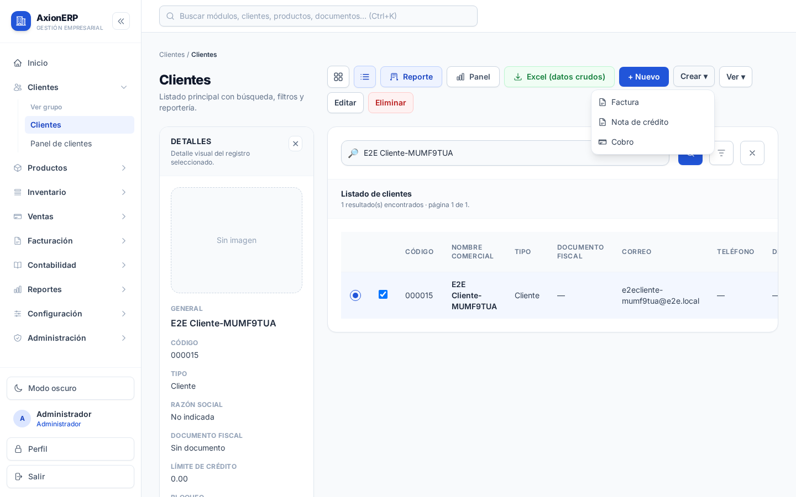

*Figura 34. Menú Crear ▾ de un cliente: Factura, Nota de crédito y Cobro.*

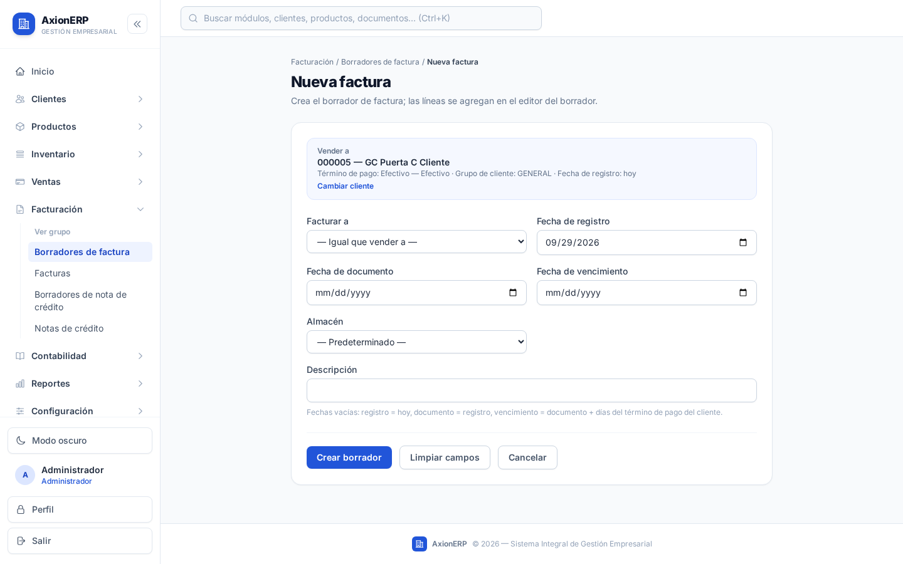

*Figura 35. Nueva factura abierta desde un cliente, con el cliente precargado.*

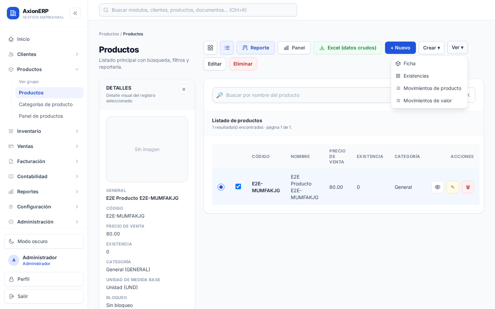

*Figura 36. Menú Ver ▾ de un producto seleccionado: Ficha, Existencias y Movimientos.*

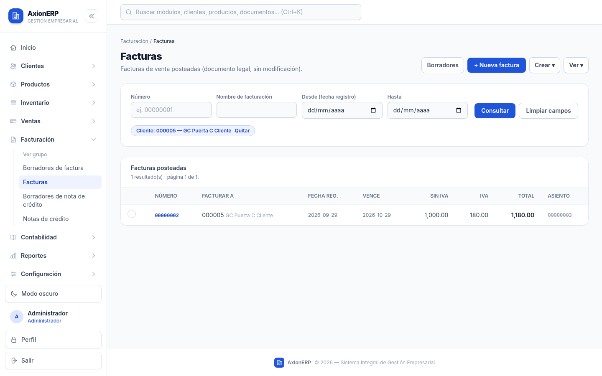

*Figura 37. Facturas filtradas por cliente, con el indicador del filtro aplicado.*

Por último, la navegación entre páginas utiliza la navegación mejorada de Blazor, que sustituye solo el contenido que
cambia. Se corrigió además el destello visual que producía la recarga de estilos en cada navegación; la figura 38
muestra una página alcanzada por navegación mejorada ya estabilizada.

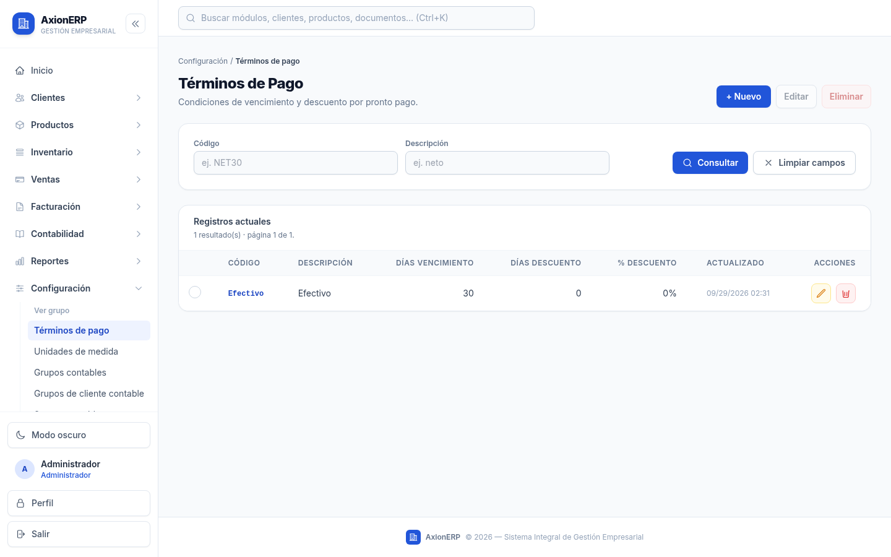

*Figura 38. Términos de pago tras una navegación mejorada, sin destello.*

## 9. Pruebas

### 9.1 Pruebas unitarias y de integración (xUnit)

Las pruebas automatizadas residen en el proyecto xUnit `OpenSource1.SmokeTests`, incluido en la solución y ejecutado
con `dotnet test test.slnx`. La suite completa suma **1684 pruebas, todas superadas**, con la compilación sin avisos; el
resumen de la ejecución se conserva en `evidencias/resumen-xunit.txt`. Las pruebas cubren tres niveles:

- **Unitarias**: validadores, reglas de negocio de los manejadores, construcción de filtros y normalización de textos,
  sin dependencias externas.
- **Integración de la API**: la API se levanta en memoria con `WebApplicationFactory` y se ejecuta contra un PostgreSQL 17
  real, en un contenedor efímero que crea la propia fixture de pruebas; así se prueban las migraciones, las consultas
  Dapper, la autorización (códigos 401 y 403) y la concurrencia (409) con la base de datos real.
- **Interfaz Blazor (SSR)**: las páginas se solicitan al host Blazor con `WebApplicationFactory` y los componentes se
  renderizan con `HtmlRenderer`, verificando el HTML generado: acciones visibles por rol, formularios, selección y
  mensajes de error.

### 9.2 Pruebas de extremo a extremo (Playwright)

La suite E2E (`tests/e2e/`, con `@playwright/test`) recorre la aplicación real desplegada con Docker Compose en un
navegador Chromium, del mismo modo que lo haría un usuario, y genera las capturas de este documento. Las credenciales se
leen solo de variables de entorno y los datos que crea llevan el prefijo `E2E` y se eliminan al terminar. La tabla
resume los resultados; el detalle está en `evidencias/resumen-e2e.md` y en los reportes HTML de `evidencias/`.

| Área | Qué se comprueba | Resultado | Figuras |
| - | - | - | - |
| Acceso y menú | Login, inicio con grupos, menú por rol, modo oscuro | Superada | 29–33 |
| Clientes | Agregar, consultar, modificar, eliminar y validación | Superada | 4–9 |
| Productos | Alta y búsquedas por código, nombre, categoría, precio y estado | Superada | 22–26 |
| Productos (mantenimiento) | Alta, modificación y eliminación | Superada | 10–12 |
| Categorías y usuarios | Categorías: alta, consulta, modificación y eliminación; usuarios: alta, ficha, desactivación y eliminación | Superada | 13–21 |
| Búsqueda global | Paleta Ctrl+K (teclado) y página `/buscar` | Superada | 27–28 |
| Acciones contextuales | Crear ▾ Factura precargada, Ver ▾ y facturas por cliente | Superada | 34–37 |
| Errores | 403 del Ejecutor, 404 de grupo inexistente, API caída | Superada | 39–41 |
| Navegación | Navegación mejorada sin destello | Superada | 38 |

La ejecución principal terminó con 14 pruebas superadas y una omitida por diseño (el caso de API caída), que se ejecuta
aparte con la API detenida y también resultó superada.

### 9.3 Manejo de errores

Las pruebas de errores verifican que el sistema falla de manera controlada. Cuando el Ejecutor intenta abrir la gestión
de usuarios, recibe la página de acceso denegado (figura 39); una ruta inexistente devuelve un código 404 con una página
informativa (figura 40); y, si la API no está disponible, la pantalla de acceso informa de que el servicio de
autenticación no responde, en lugar de mostrar un error técnico (figura 41).

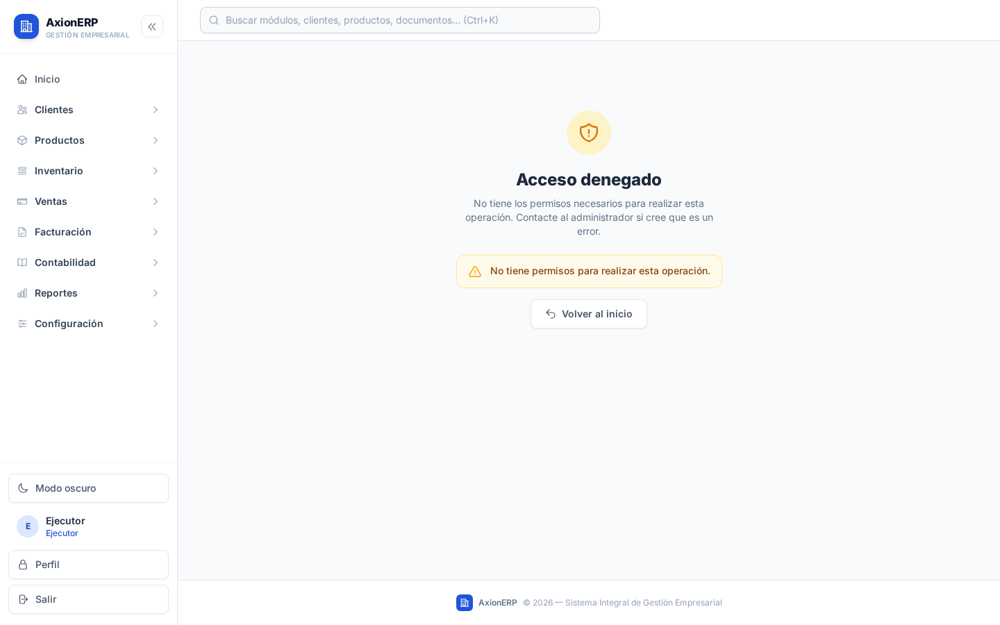

*Figura 39. Acceso denegado (403) del Ejecutor a la gestión de usuarios.*

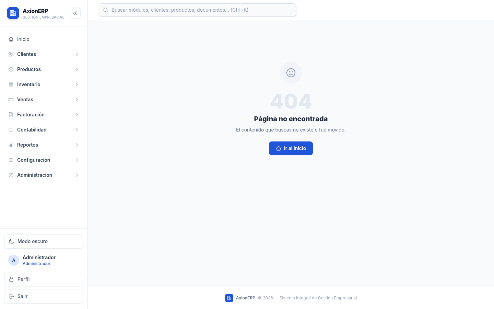

*Figura 40. Página no encontrada (404) para un grupo inexistente.*

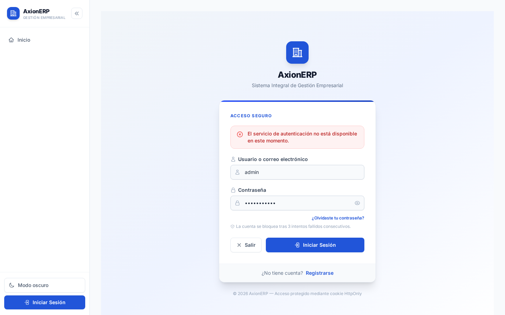

*Figura 41. Inicio de sesión con la API detenida: aviso de servicio no disponible.*

## 10. Entrega

### 10.1 Contenido del entregable

El código fuente se encuentra en el repositorio OpenSource1, rama `Fix-Features`. Los artefactos del entregable están en
la carpeta `docs/entregable-parte-1/`:

| Artefacto | Descripción |
| - | - |
| `documento-tecnico.docx` | Este documento (formato de entrega); su fuente es `documento-tecnico.md`. |
| `diagramas/` | Arquitectura, modelo entidad-relación (completo y parciales) en PNG, SVG y Mermaid, y diccionario de datos. |
| `capturas/` | Capturas de 1440×900 generadas por la suite E2E, numeradas por flujo. |
| `evidencias/` | Resumen de la suite xUnit, resumen y reportes HTML de la suite E2E. |
| `presentacion.pptx` | Presentación breve del proyecto (9 diapositivas). |
| `guion-demo.md` | Guion de la demostración en vivo, con tiempos, usuarios y URL. |

### 10.2 Cómo levantar el sistema

1. Copiar `.env.example` a `.env` y definir `POSTGRES_PASSWORD`, `JWT_SIGNING_KEY` y `AUTH_SEED_DEFAULT_PASSWORD`;
   `POSTGRES_PORT` permite publicar PostgreSQL en otro puerto si el 5432 está ocupado.
2. Ejecutar `docker compose up -d --build` en la raíz del repositorio. La API aplica las migraciones al arrancar.
3. Abrir la interfaz en `http://localhost:8080`; la API queda en `http://localhost:8081`.
4. Iniciar sesión con uno de los usuarios semilla, `admin`, `supervisor` o `ejecutor`, cuya contraseña es el valor de
   `AUTH_SEED_DEFAULT_PASSWORD`.

### 10.3 Trazabilidad de los pasos del enunciado

| Paso | Sección | Evidencia |
| - | - | - |
| 1. Planteamiento del problema | 1 | Tabla de roles y permisos |
| 2. Tecnología y lenguaje | 2 | Proyectos de la solución (`test.slnx`) |
| 3. Arquitectura | 3 | Figura 1 (`diagramas/arquitectura.png`) |
| 4. Base de datos | 4 | Figuras 2 y 3, `diagramas/diccionario-datos.md` |
| 5. Persistencia | 5 | 38 migraciones en `Data/Migrations/Application` |
| 6. Mantenimientos (CRUD) | 6 | Figuras 4–21; suite E2E (specs 02, 03 y 04) |
| 7. Búsquedas | 7 | Figuras 22–28; suite E2E (specs 03 y 05) |
| 8. Menú | 8 | Figuras 29–38; suite E2E (specs 01, 06 y 08) |
| 9. Pruebas | 9 | `evidencias/resumen-xunit.txt`, `evidencias/resumen-e2e.md`, figuras 39–41 |
| 10. Entrega | 10 | `presentacion.pptx`, `guion-demo.md` |
